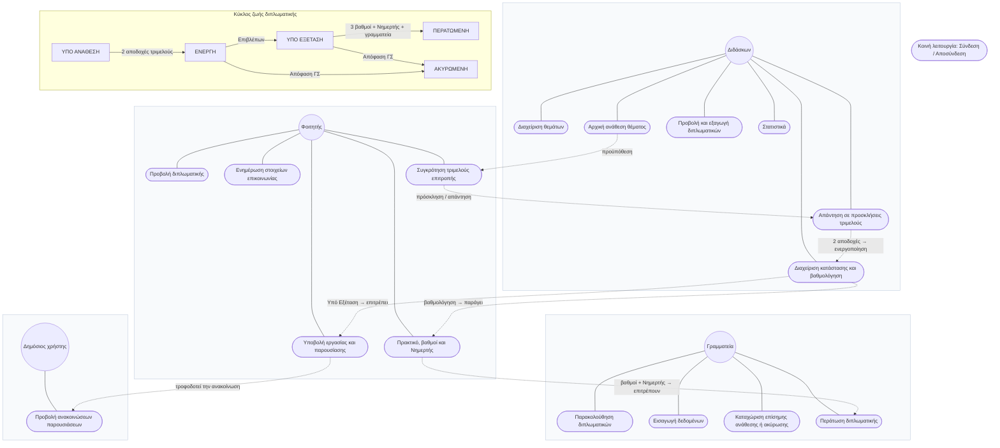

# ThesisFlow — Use Case Diagram

Απλοποιημένο διάγραμμα με τα βασικά use cases ανά ρόλο.

Οι συνεχείς γραμμές συνδέουν κάθε ρόλο με τις λειτουργίες του. Οι διακεκομμένες
γραμμές δείχνουν τις βασικές εξαρτήσεις και τη σειρά ενεργοποίησης μεταξύ των
use cases.
